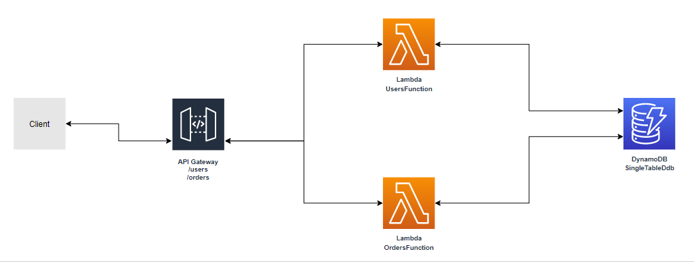

# Welcome to your CDK TypeScript project!

This is a project for TypeScript development with CDK.

The `cdk.json` file tells the CDK Toolkit how to execute your app.

## Useful commands

 * `npm run build`   compile typescript to js
 * `npm run watch`   watch for changes and compile
 * `npm run test`    perform the jest unit tests
 * `cdk deploy`      deploy this stack to your default AWS account/region
 * `cdk diff`        compare deployed stack with current state
 * `cdk synth`       emits the synthesized CloudFormation template

# Example CDK project with a DynamoDB Single Table Design

The purpose of this CDK project is to exemplify and demonstrate the use of the Single Table Design with DynamoDB.

Please check the files/adrianosastre-AWS-Managed-Services-DynamoDB.pdf for more details.

## Architecture

* API Gateway
    * /users and /products resources
* Lambdas (Node.js) - APIs and DynamoDB handling
    * users function
    * orders function
* DynamoDB - users and orders data
    * Single table design concept

[

# System's requirements and instructions to get the environment ready

## Node.js and NPM

Download the Node.js https://nodejs.org/en/download/

To double-check if Node.js was installed correctly:

```sh
node -v
```

To double-check if NPM was installed correctly:

```sh
npm -v
```

## NestJS CLI

NestJS is a framework that simplifies the REST creation:

```sh
npm i -g @nestjs/cli
```

## AWS CLI

Installation link: https://aws.amazon.com/cli/

```sh
aws --v
```

* IAM user creation

Open the AWS Console -> IAM, add a user with "Programmatic access" and choose the "Administrator Access" policy.

Click "Next" till the last screen with the effective user creation.

Copy the new user's access credentials ("Access Key Id" and "Secret Access Key").

* Configuring AWS CLI with the IAM user credentials

Type in the command:

```sh
aws configure
```

* Parameter 1: Access Key ID
* Parameter 2: Secret Access Key
* Parameter 3: us-east-1
* Parameter 4: JSON

## AWS CDK

The AWS Cloud Development Kit (AWS CDK) will be used to build the code responsible for creating the AWS services infrastructure:

```sh
npm install -g aws-cdk
```

```sh
cdk --version
```

## Docker

Docker images are used with the aws-cdk/aws-lambda-nodejs lib.

Download: https://www.docker.com/products/docker-desktop

To check if Docker was installed correctly:

```sh
docker -v
```

## Visual Studio Code

Download the Visual Studio Code: https://code.visualstudio.com/

Extensions:

* AWS Toolkit
* AWS CDK

## Postman

Postman can be used in order to test the API.

Download: https://www.postman.com/
